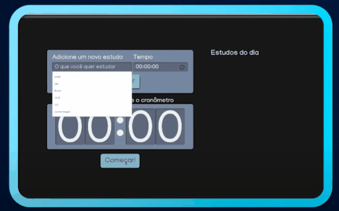

<h2>Aplicação de Organização de Tarefas</h2>

Criação de uma aplicação na qual vamos: 
* Adicionar tarefas a executar e o tempo para cada uma, as quais serão enviadas para uma lista;
* Selecionar na lista qual das tarefa vamos executar - após selecionada, o tempo da tarefa é enviado para o cronômetro;
* Acionar o cronômetro para acompanhamento.
* Após a finalização do cronômetro, a tarefa é marcada como concluída e o acesso a ela é retirado.

## Objetivos do Projeto:

- Criar um projeto React com Typescript com Create React App
- Entender conceitos de React como Componentização, Props e State
- Utilizar o Sass para fazer o CSS mais rápido
- Evitar sobreposições de CSS com CSS Modules
- Aprender sobre os hooks useState e useEffect e entender como eles eram usados nos class components
- Deixar o código mais limpo e documentado com a forma mais atual de se escrever React
- Desenvolver o código com conceitos de boas práticas como DRY (Don't Repeat Yourself) e SRP (Single Responsibility Principle)
- Analisar como funciona uma transição/refatoração de um Class component, uma forma antiga, para um Function component, que é uma forma mais atual de se escrever React, entendendo a diferença deles e o motivo do Function component ser priorizado

## Agradecimento
Um Valeu! especial ao @Vinícius Ribeiro, da Comunidade Code no Discord, que deu uma mentoria super valiosa para melhorar meu entendimento do projeto!